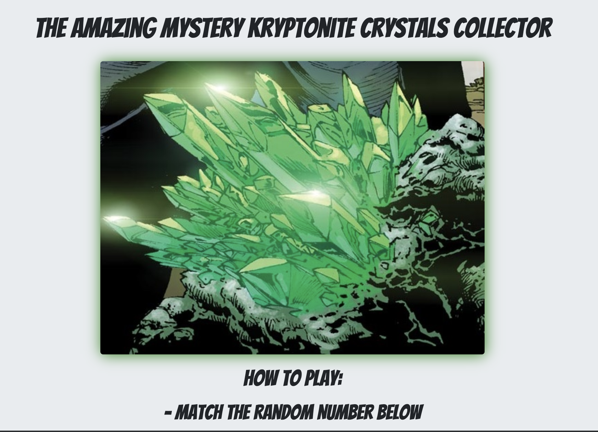

# unit-4-game

CrystalsCollector Game is an interactive game for web browsers. Dynamically updates the HTML pages with the jQuery library.

To view live application:  https://johandenver.github.io/unit-4-game/

There will be four crystals displayed as buttons on the page.

The player will be shown a random number at the start of the game.

When the player clicks on a crystal, it will add a specific amount of points to the player's total score. 
 
Your game will hide this amount until the player clicks a crystal.

When they do click one, update the player's score counter.

The player wins if their total score matches the random number from the beginning of the game.

The player loses if their score goes above the random number.

The game restarts whenever the player wins or loses.

When the game begins again, the player should see a new random number. Also, all the crystals will have four new hidden 
values. Of course, the user's score (and score counter) will reset to zero.

The app should show the number of games the player wins and loses. To that end, do not refresh the page as a means to restart 
the game.

The random number shown at the start of the game should be between 19 - 120.

Each crystal should have a random hidden value between 1 - 12.

## Getting Started

Download zip file.

Open file in IDE of choice to view code.

Open index.html in browser to view application.

## Built With

* [Javascript](https://developer.mozilla.org/en-US/docs/Web/JavaScript) - The programming language used for all logic of the    game.
* [Bootstrap](https://getbootstrap.com/) - Used components from toolkit for developing the HTML layout. 
* [CSS](https://developer.mozilla.org/en-US/docs/Web/css) - used for styling of the application.
* [Google Fonts](https://fonts.google.com/) - Used to generate font styles.

## Authors

* **Jonathan Peine - Initial work - [Github](https://github.com/johandenver)

## Acknowledgments

* shout out to TA, Instructor and Tutor! 
